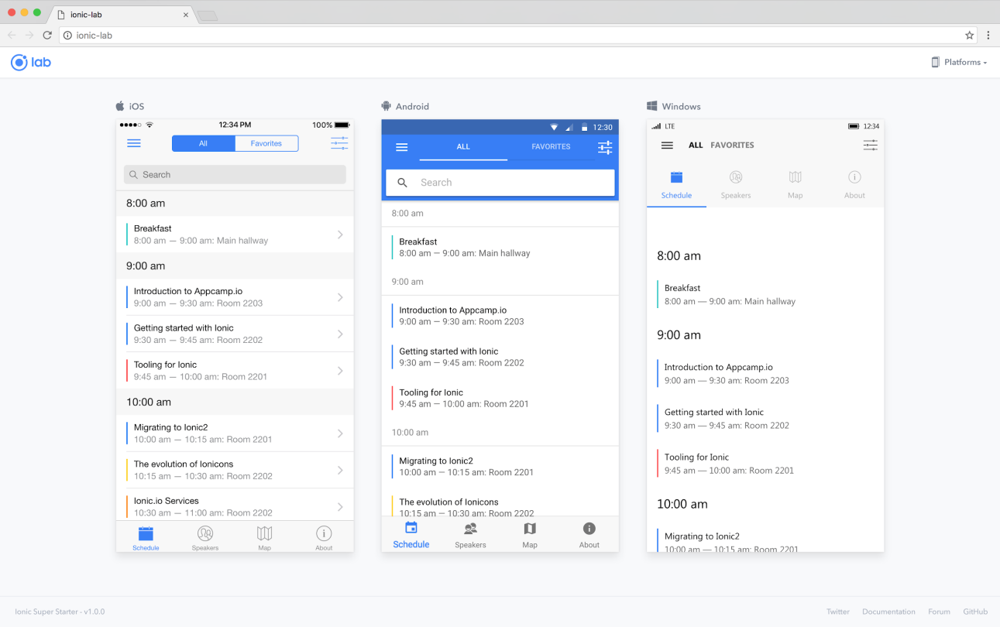
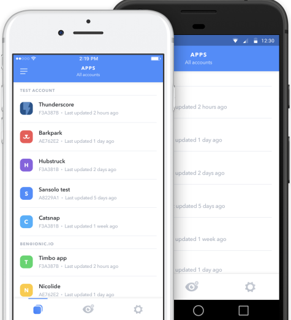
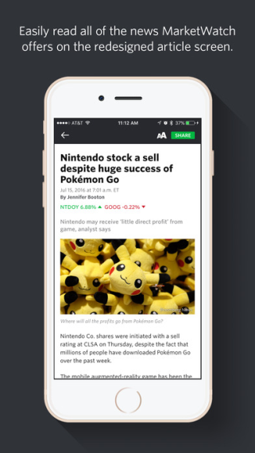
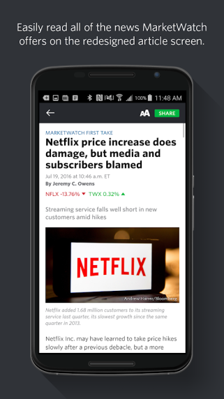
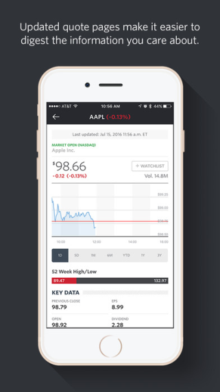

## Ionic Mobile Dev
## Segfaulting Shibish
### Ish Mahdi, Marcus Ng, and Gordon Lei

[Ionic Framework](https://ionicframework.com/)

[Ionic Docs](https://ionicframework.com/docs/)


## What is Ionic?

Ionic is an HTML5 mobile app development framework used to create hybrid mobile apps (iOS, Android, and Windows). Users develop apps using HTML, CSS (SCSS), and JS (TS).


## How does it work?

Ionic relies on two dependencies: 
- Ionic Command Line Utility
  - Enables you to use command line commands to easily create Ionic apps
  
  Create New Project Example:
  ```
  $ ionic start <name>
  $ cd ./name
  $ ionic server
  ```
  
- Cordova
  - Enables native capabilties in your apps
  
  iOS Example:
  ```
  $ npm install -g cordova
  $ ionic cordova --help
  $ ionic cordova run ios
  ```

## Simulators
Different simulators are displayed in your browser. They reflect live changes to code.



## Hybrid Apps
### Pros
- Single source code (easier to maintain and update)
- Develop one app that works on across mobile platforms
- Updated on the fly without having to ship a new build to the App and Play Stores
- If you are large company like Netflix, the quick development and low cost/maintenance is very attractive
- You do not need to learn new languages like Objective-C/Swift (iOS) or Java/Kotlin (Android)

### Cons
- In-app performance is slower than if the app was built natively
- Using some features of the phone such as the camera or GPS may require 3rd party plugins 
- More prone to bugs
- When a new iOS version is released, you have to wait for your framework to support the new OS before you can develop for the new version


## Ionic View
Ionic View allows developers to share their apps before they are released on the app stores. It also allows developers to A/B test their apps to figure out which version their users like more. Users are able to submit feedback with screenshots and comments. This is an alternative to Apple's TestFlight, which is used to collect feedback on unreleased iOS apps. Compared to TestFlight, however, Ionic View enables developers to go around the iOS App Review Board by skipping Apple's app review process to test their app. If developers used TestFlight, the iOS App Review Board would have to review their app first to make sure it complies with Apple's strict app guidelines.

<p align="center">
  
</p>

## App Example: Market Watch
Market Watch was created using the Ionic Framework. Notice the similar user interfaces of the iOS and Android versions of the app.


The left column is iOS, while the right is Android.

<p align="center">
  
  
</p>

<p align="center">
  
  
</p>


[More Top Ionic Apps](https://showcase.ionicframework.com/apps/top)


## Demo Code
**PICTURES**

[Demo Code Repo](https://github.com/GordonLei/ProbablyNotSandwhich)

How to view + use demo code: 
- Clone the repo
- In the repo navigate through src/pages/home
- Copy and paste the three files into the similar location within our project. 
- Make sure that your app either by default has a way to go to HomePage or can navigate to HomePage. (use the documentation to help you create a button that leads to HomePage if neccessary). 

We will be mainly focusing on the TS (typescript) and html aspects with ionic. 
Thus, before you should remember to import the necessary files in your .ts file. 
For what features the demo code shows, it is necessary to import / do:
```
import { Component } from '@angular/core';
import { NavController } from 'ionic-angular';
import { ActionSheetController } from 'ionic-angular';
import { AlertController } from 'ionic-angular';
import { App, MenuController } from "ionic-angular";
```
Our demo code will teach you how to make these features of ionic:
- **Action Sheets**
  - These are the options that pop up when you slide up or down from the edges of your screen, pop up from pressing buttons, or from holding down something. These are more or less a set of options you can do after triggering an event. 
  
  To create action sheets:
  
  - First in your .ts file, create a variable for your action sheet within the overall page constructor by adding this in the constructor:
  ```
  constructor(
      ...
      public <action sheet name>: ActionSheetController,
      ...
  )
  ```
  
  - Then create a function to create your action sheet by inputting your desired name and buttons that you want the action sheet to have (replace customFunctionName with a name you want. readMe doesn't like angle brackets outside of braces):
  ```customFunctionName(){
      let <name for variable that holds all of action sheet's information> = this.<action sheet name>.create({
        title: " <title you want> ",
        subtitle : " <optional subtitle you want> ",
        buttons : [<whatever buttons you want your action sheet to have. button syntax will be explained later>]
        });
        <name for variable that holds all of action sheet's information>.present();
    }
  ```
  - Ex)
  ```
    presentActionSheet() {

    //Action sheets are composed of an array of buttons that have different properties and other nifty stuff like titles.
      let actionSheet = this.actionSheetCtrl.create({
        title: 'Modify your album', //this is the title of the action sheet
        subTitle: 'Im not creative enough to think of a subTitle',
        buttons: [
        //order of buttons show by which one you add first
        {
          text: 'Destructive',
          role: 'destructive', //destructive means that it will cancel out of the sheet 

          /*
          Handler is a function that tells what the button does

          handler: () => { COOL FUNCTION PROCESS THINGO HERE }
          This is a function declaration (basically a shorthand way to make a function).
            Shorthand for doing:
              var handler = function() { COOL FUNCTION PROCESS THINGO HERE }
          */
          handler: () => {
            console.log('Destructive clicked');
          }
        },{
          text: 'Archive',
          handler: () => {
            console.log('Archive clicked');
          }
        },{
          text: 'Cancel',
          role: 'cancel', //cancel buttons make them appear at the bottom
          handler: () => {
            console.log('Cancel clicked');
          }
        }
      ]
    });
    actionSheet.present(); //this basically means display the action sheet
  }
  ```
- **Alerts**
  - Alerts are what they sound like they do; they are pop ups that alert you of something.
  - To create alerts:
    - First in your .ts file, create a variable for your action sheet within the overall page constructor by adding this in the constructor:
    ```
    constructor(
        ...
        public <alert name>: AlertController,
        ...
    )
    ```
    - Then create a method to create the alert(replace customFunctionName with a name you want. readMe doesn't like angle brackets outside of braces):
    ```
    customFunctionName(){
        let <name for variable that holds all of alert's information> = this.<alert name>.create({ 
        title: " title you want ",
        subtitle : " optional subtitle you want ",
        buttons : [whatever buttons you want your alert to have. button syntax will be explained later]
        });
        name for variable holds all of alert's information.present();
    }
    ```
  
  - Ex)
  ```
  presentAlert(){
      let alert = this.alertCtrl.create({
        title: "WOAH LOOK AT THIS COOL POP-UP ALERT",
        subTitle: "PLEASE READ THIS",
        buttons:["DISMISS"]
      });
      alert.present();
  }
  ```
  
- **Buttons**
  - Buttons hold a function and will activate / do the function the button is triggered by a user input.
  - To create an ionic button, in your html write: 
  ```
  <button ion-button <any special ionic button "classes you want"> (<an user input>) = "<button's function>">
  </button
  ```
  - Ionic already has preset "button classes" that you can type directly into the button tag without having to write "class= ". These can be found here: [Ionic buttons](https://ionicframework.com/docs/api/components/button/Button/)
  - Then in your .ts file, create the function of whatever you want the button to do, whether it be to give the user an alert, pop up an action sheet, etc.
  - When creating specific buttons within things such as action sheets, you should know that buttons are stored in a list of dictionaries. For example, if you are creating buttons within an actionsheet, the syntax is:
  ```
  ...
  buttons: [
    {
      text: "<name on the button",
      role: "<specific preset ionic button roles such as "cancel". You can read more about this in the documentation>",
      handler: () => {
        <whatever you want the function to do. ex) log something into console>
        }
    },
    <other buttons if needed>
  ]
  ...
  ```

  - For example:
    ```
    buttons: [
      //order of buttons show by which one you add first
      {
        text: 'Destructive',
        role: 'destructive', //destructive means that it will cancel out of the sheet 
        /*
        Handler is a function that tells what the button does
        handler: () => { COOL FUNCTION HERE }
        This is a function declaration (basically a shorthand way to make a function).
          Shorthand for doing:
            var handler = function() { COOL FUNCTION HERE }
        */
        handler: () => {
          console.log('Destructive clicked');
        }
      },{
        text: 'Archive',
        handler: () => {
          console.log('Archive clicked');
        }
      },{
        text: 'Cancel',
        role: 'cancel', //cancel buttons make them appear at the bottom
        handler: () => {
          console.log('Cancel clicked');
        }
      }
    ]
    ```
- **Cards**
  - Cards are like Bootstrap's Cards; they are special ways to display information.
  - You can create cards by following this syntax in your html:
    ``` 
      <ion-card> 
        <ion-card-header> SAMPLE-TEXT.mp3 </ion-card-header> 
        <ion-card-content> Content here </ion-card-content>
      </ion-card>
    ```
    - ion-card is the overall wrapper for the card.
    - ion-card-header is the special heading you want to put at the top of the Card. 
    - ion-card-content is where you place your desired inner text. 
- **Dynamic Events / User input**
    - Ionic allows you to store information about how people interact with items, such as how many times they tapped, pressed, panned, or swiped a button. 
      - To do this, first add a variable in your .ts file to store the # of times something is done. 
        - Ex) ```public countPress: number = 0; ```
      - Then create a function that will update that variable.
        - Ex) 
        ```
          panEvent(e){
            this.countPan++;
          }
        ```
      - Then in your .html file create your button following this syntax:
        ```
          <ion-card (<action name>)="<eventUpdate function name>($event)">
            <div> Time swiped:  </div>
          </ion-card>
        ```
      - Ex) 
        ```
          <ion-card (swipe)="swipeEvent($event)">
            <div> Time swiped: {{countSwipe}} </div>
          </ion-card>
        ```
- **Menus**
  - Menus hold a list of options that you can choose from to trigger and event to occur, whether it be to navigate through pages, open up a confirmation, etc.
  - To create a menu:
    - First in your .ts file, create a variable for your menu sheet within the overall page constructor by adding this in the constructor:
      - Ex)
      ```
      constructor(
        ...
        menu: MenuController
        ...) {menu.enable(true);}
      ```
      By doing this so this enables the menu functions for your code.
    - In your html, follow this syntax to create your physical menu:
      ```
      <ion-menu [content]=" <reference to menu> ">
        <ion-content>
           <ion-list>
             PUT WHATEVER YOU WANT THE MENU TO HAVE HERE (LIKE BUTTONS AND STUFF)
           </ion-list>
        </ion-content>
      </ion-menu>
      <ion-nav <reference to menu> [root]="<name of the page you are in"> </ion-nav>
      <button menuToggle> PUT WORDS HERE </button>
      ```
      According to the Ionic documentation The ion-nav tag is necessary to tell the menu what it is bounded too.
      Thus, by adding a button under the ion-nav, the button will toggle the menu. 
- **Ranges** 
  - Ranges are basically sliders that the user can drag to either increase or decrease a variable.
  - In your .html file, to create a range follow this syntax:
  
    ```
    <ion-item>
      <ion-range min="<put a number here>" max = "<put a number here>">
        <ion-label range-left> <put the first number here> </ion-label>
        <ion-label range-right> <put the second number here> </ion-label>
      </ion-range>
    </ion-item>
    ```
   - Ion-labels puts labels on the sides of the range to show what your min and max is; however ion-labels may not show the correct min and maxes if you do not put the correct numbers within the label tags.
   - If you want to put "snaps" on the range, or in other words put a set interval on the range, within the ion-range tag add:
      ```
      step="<your desired increment>" snaps = true
      ```
    - For example:
    
    ```
    <ion-item>
      <ion-range min="0" max="100">
      //you can write labels to show the bounds of the slider
      <ion-label range-left> 0 </ion-label>
      <ion-label range-right> 100 </ion-label>
      </ion-range>
    </ion-item>
    ```
- **Icons**
  - Ionic has preset icons that you can use to stylize buttons and other such features.
    - First, look for which icon you want in [Ionic's Icon List](https://ionicframework.com/docs/ionicons/) and remember the name of the icon
    - In your html, where ever you want to put the icon add:
    
    ```<ion-icon name = <name of the icon you wanted>></ion-icon>```
    - Example:
    
    ```<ion-icon name = "planet"></ion-icon>```
